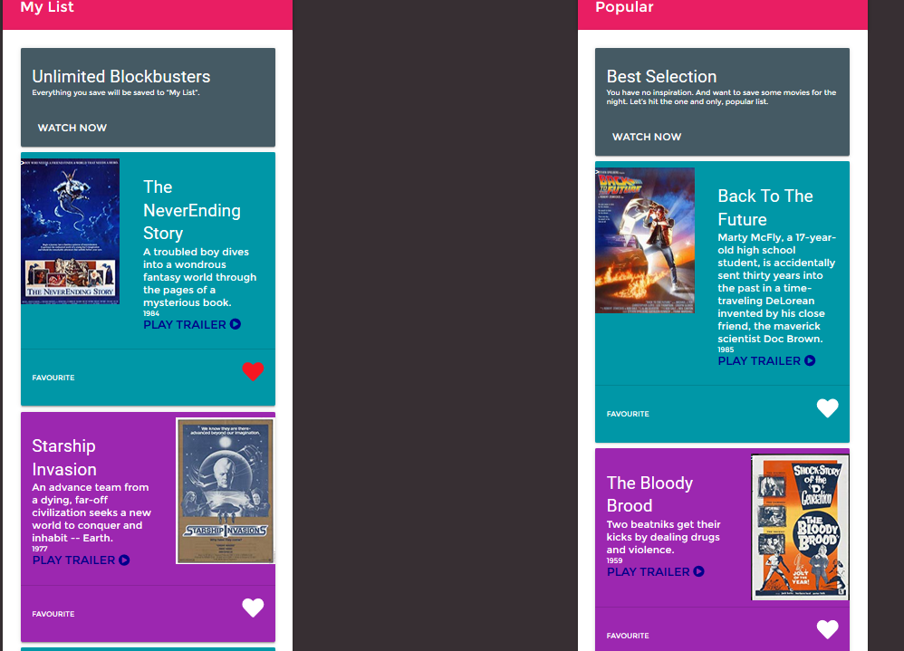
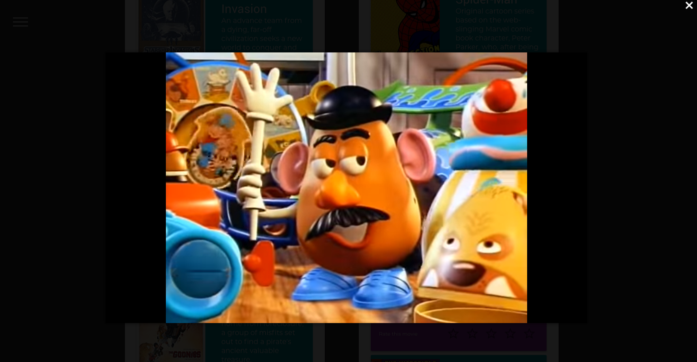

### Roku ‘Flashback’ microsite

The Flashback app is part of the Roku streaming service. Subscribers can use this app to
access three separate flashback features; movies, television (tv) and music. Each of these three
sections are comprised exclusively of entertainment from 1950, 1960, 1970, 1980, and 1990
respectively.
One of Flashback's main usability features is the demarcation of the user profile. Users will be
divided into two distinct categories; administrators (labeled; Parents) and Kids. Parents will have
the ability to access all of Flashbacks' content and admin controls while 'Kids' will be limited to
content pushed down from Flashbacks “kid-friendly content" protocol queries. Admin users will
have the ability to customize settings being pushed down from Flashbacks CMS to provide a
unique viewing experience for their children.

## Team

- Camillo Angelozzi (Web Developer)
- Jeril Kadavan (Web Designer)

### HERO section

## Landing Page

Accessibility for landing page with option to choose a LIGHT or DARK theme 

## Login

Login appears through button or hamburger sidebar.

## Users Page

Netflix style users access. Parents which are also ADMIN have access to Settings Dashboard. Kids once loggged in, do not have access to any setting configuration

## Settings Page

Parents/Admin can limit access to content, block accounts and change accounts roles. All functionality is linked to Database tables.

## Content Page

Content is filtered for Parents and Kids. Filter can be changed and accessed just by Parents/Admin. Kids have access to G and Family Rating material.

Rating system available, and play trailer through Youtube channel.

#### Kids Example

#### Parents Example

## SideMenu

SideMenu gives access to main functions and navigation.

## Tools used during development phase:

- Adobe Illustrator, Photoshop, XD
- PHP/MySQL
- Gulp.js
- SASS
- Javascript Fetch API, to get data from backend database
- Vuetify

## Giving credits for places that helped to do this project

- https://stackoverflow.com/
- https://vuetifyjs.com/en/
- https://vuejs.org/
- https://router.vuejs.org/

## Future Improvements

- Move to a Webpack based build in VueCLI3
- Further refactoring SASS structure.
- Update Backend, perhaps with a NoSQL structure (NodeJS, MongoDB, GraphQL)
